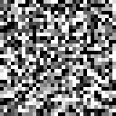
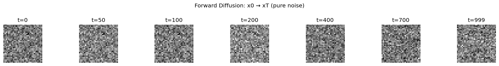
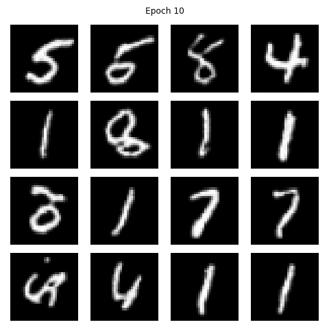
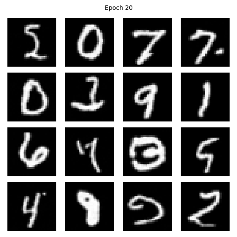
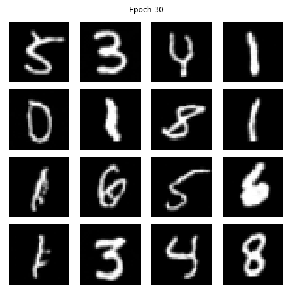
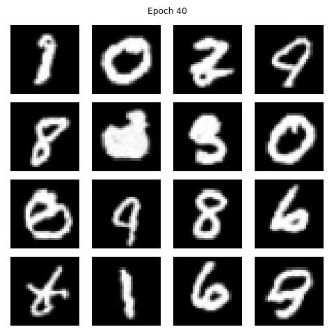
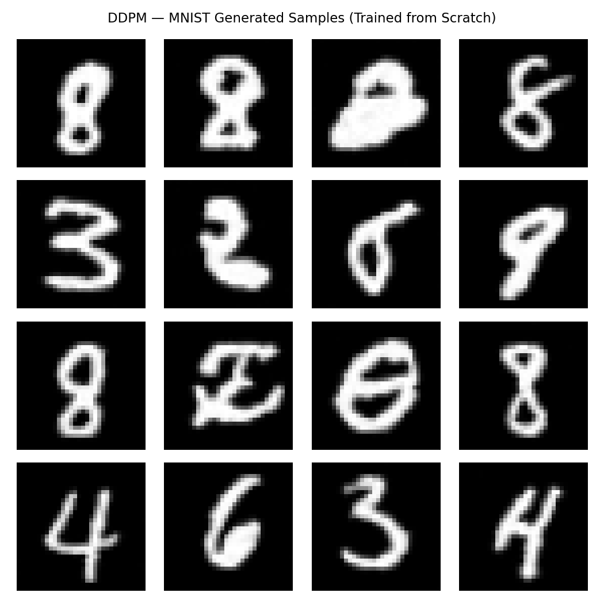

# rahulk-ddpm

[](https://python.org)
[](https://pytorch.org)
[](LICENSE)

Denoising Diffusion Probabilistic Models (Ho et al., 2020) implemented from scratch in PyTorch.  
No diffusers library. No pretrained weights. Just math → code → results.

> 🔥 Generating handwritten digits from pure Gaussian noise — trained on MNIST in ~1 hour on free Kaggle GPUs.

---

## Results

### Denoising Process — xT → x₀


### Forward Process — x₀ → xT (pure noise)


### Training Progression
| Epoch 10 | Epoch 20 | Epoch 30 | Epoch 40 |
|:--------:|:--------:|:--------:|:--------:|
|  |  |  |  |

### Final Generated Samples (Epoch 40)


---

## How DDPM Works

**Forward process** — gradually destroy an image with Gaussian noise over T=1000 steps

**Reverse process** — UNet learns to predict and remove noise step by step

**Key insight** — we predict noise ε (not the image directly) because we know the exact noise added at each step. This makes training stable with a simple objective:

```
Loss = MSE(predicted_noise, actual_noise)
```

---

## Architecture

```
Input (xₜ, t)
│
├── SinusoidalTimeEmbedding(t) → injected at every ResBlock
│
[Encoder]
  ResBlock(1→64)    ──────────────────────── skip_1
  ResBlock(64→128)  ──────────────────────── skip_2
[Bottleneck]
  ResBlock(128→256)
  SelfAttention(256)
  ResBlock(256→128)
[Decoder]
  ConvTranspose + skip_2 → ResBlock(256→64)
  ConvTranspose + skip_1 → ResBlock(128→64)
│
Conv1x1 → ε_pred
```

**Parameters: 3.6M**

---

## Project Structure

```
rahulk-ddpm/
├── model/
│   ├── __init__.py
│   ├── time_embedding.py     # Sinusoidal embeddings
│   ├── resblock.py           # ResNet blocks + time conditioning
│   ├── attention.py          # Self-attention at bottleneck
│   └── unet.py               # Full UNet noise predictor
├── scheduler/
│   ├── __init__.py
│   └── noise_scheduler.py    # Linear β schedule, forward + reverse
├── train.py                  # Training loop
├── sample.py                 # Reverse diffusion + GIF export
├── config.yaml               # Hyperparameters
└── assets/
    ├── denoising.gif
    ├── forward_diffusion.png
    ├── final_samples.png
    └── samples/
        ├── epoch_010.png
        ├── epoch_020.png
        ├── epoch_030.png
        └── epoch_040.png
```

---

## Quickstart

```bash
git clone https://github.com/rahulkhunte/rahulk-ddpm.git
cd rahulk-ddpm
pip install torch torchvision pyyaml pillow matplotlib
```

**Train from scratch:**
```bash
python train.py
```

**Generate samples + GIF from checkpoint:**
```bash
python sample.py --ckpt checkpoints/ddpm_epoch_40.pth
```

---

## Training Details

| Config | Value |
|--------|-------|
| Dataset | MNIST 32×32 |
| Training samples | 60,000 |
| Diffusion steps T | 1,000 |
| β schedule | Linear 1e-4 → 0.02 |
| Epochs | 40 |
| Batch size | 64 |
| Learning rate | 1e-4 |
| Optimizer | Adam |
| Hardware | Kaggle 2×T4 GPU |
| Final loss | ~0.0155 MSE |

---

## Reference

Ho, J., Jain, A., & Abbeel, P. (2020). **Denoising Diffusion Probabilistic Models**. NeurIPS 2020.  
https://arxiv.org/abs/2006.11239

---

## Acknowledgements

Built while studying the original DDPM paper from scratch.  
Architecture inspired by [Ho et al., 2020](https://arxiv.org/abs/2006.11239).

---

**Rahul Khunte** — [github.com/rahulkhunte](https://github.com/rahulkhunte)
