# rahulk-ddpm

[](https://python.org)
[](https://pytorch.org)
[](LICENSE)

Diffusion models built from scratch in PyTorch — no `diffusers`, no pretrained weights, just math → code → results. The repo grew from a single image DDPM into **three subsystems** that together sketch a path toward correctness-guaranteed generative pedagogy.

| # | Subsystem | Maturity | What it is |
|---|-----------|----------|------------|
| 1 | **Image DDPM** | **Mature** | Pixel-space DDPM — UNet noise predictor, cosine schedule, EMA, FID eval. Generates MNIST/CIFAR-10 from pure noise. |
| 2 | **VideoDiT** | **Prototype** | Spatiotemporal Diffusion Transformer. Generates temporally-coherent video from pure noise (synthetic square → MovingMNIST). |
| 3 | **Pedagogy correctness engine** | **Working** | A deterministic formula ledger + validator that guarantees every formula shown in an educational animation is *exactly* correct. The moat. |

> **Honest framing.** This is a from-scratch learning-and-research repo, not a product. The image DDPM is solid. The video model is a real working prototype on *toy* datasets with *known capacity ceilings* (blobby digits, full O(N²) attention). The pedagogy engine is small but genuinely useful — and it's the piece with the clearest reason to exist. Limitations are called out throughout rather than hidden.

---

## Results

### 1 · Image DDPM

**Denoising xₜ → x₀** &nbsp;|&nbsp; **Forward x₀ → xₜ**

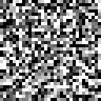
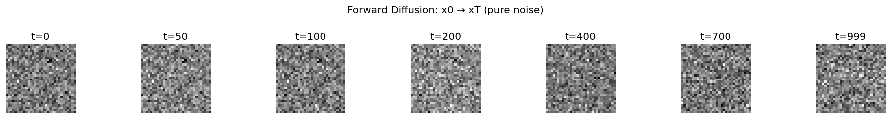

Training progression (CIFAR-10) and final MNIST samples:

| Epoch 10 | Epoch 20 | Epoch 30 | Epoch 40 |
|:--------:|:--------:|:--------:|:--------:|
| 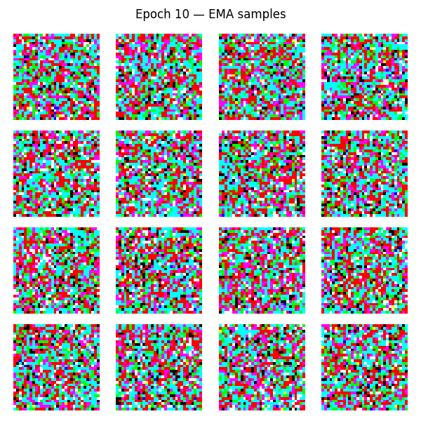 | 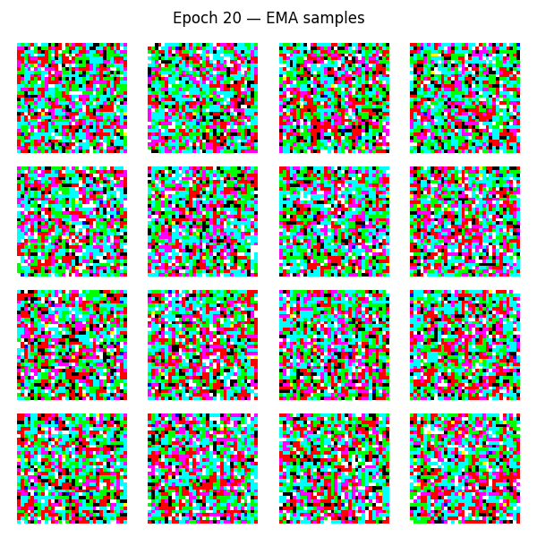 | 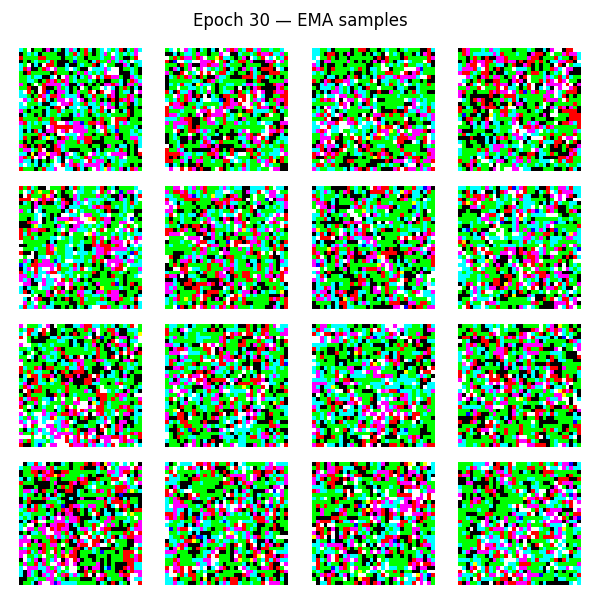 | 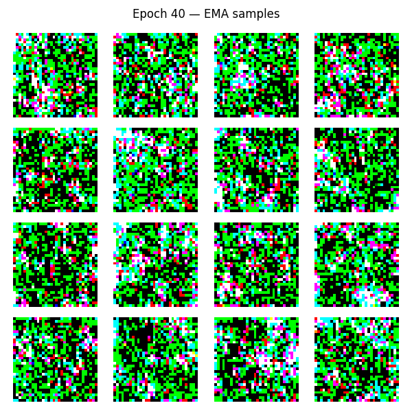 |

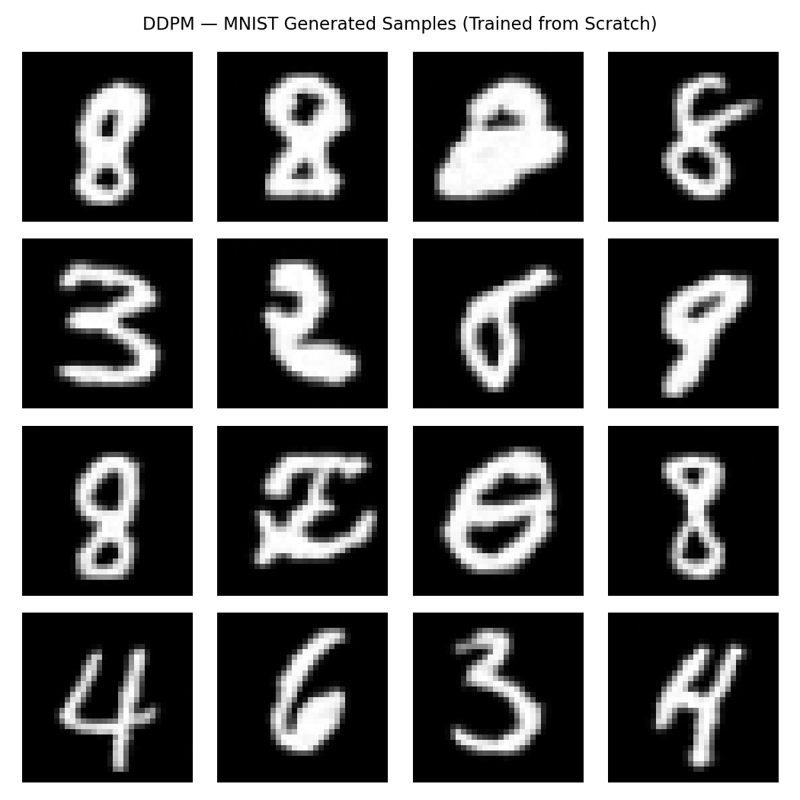

### 2 · VideoDiT — video from pure noise

**Hero demo — synthetic moving square.** A 7M-param spatiotemporal DiT, conditioned on the square's trajectory via AdaLN, generates temporally-coherent moving squares from pure Gaussian noise:

| Generated sample 0 | Generated sample 1 |
|:------------------:|:------------------:|
| 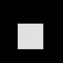 | 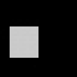 |

Ground truth (even rows) vs generated-from-noise (odd rows), 16 frames each:

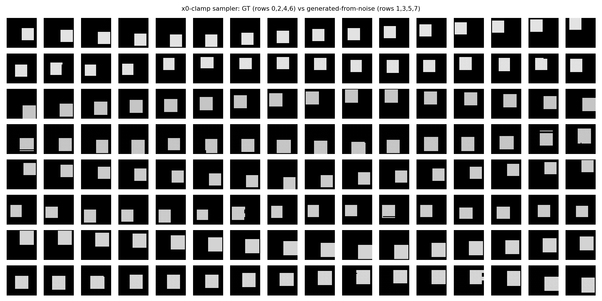

**Generalization evidence — MovingMNIST.** With the sampler fixed (see [Debugging the nucleation collapse](#debugging-the-nucleation-collapse)), the *same* model trained **unconditionally** on MovingMNIST (real video, no labels) samples moving digit-strokes from pure noise without collapsing — the fix carries over from the toy square to real data:

| Generated clip (gif) | Four clips × 16 frames |
|:--------------------:|:----------------------:|
| 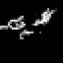 | 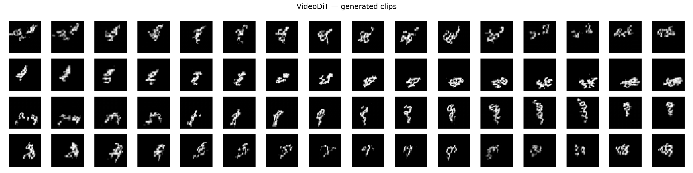 |

The strokes are **blobby rather than crisp digits** — a model-capacity / resolution ceiling at this scale, *not* a collapse. Sharper output is a documented next step (smaller `patch_size`, factorized spatial+temporal attention to keep it affordable under the current full O(N²) attention).

### 3 · Pedagogy correctness engine

A from-scratch pipeline that **validates** canonical formulas, then **renders + animates** them into reusable instructional assets — with a SHA-256 audit trail. Nothing incorrect is ever drawn.

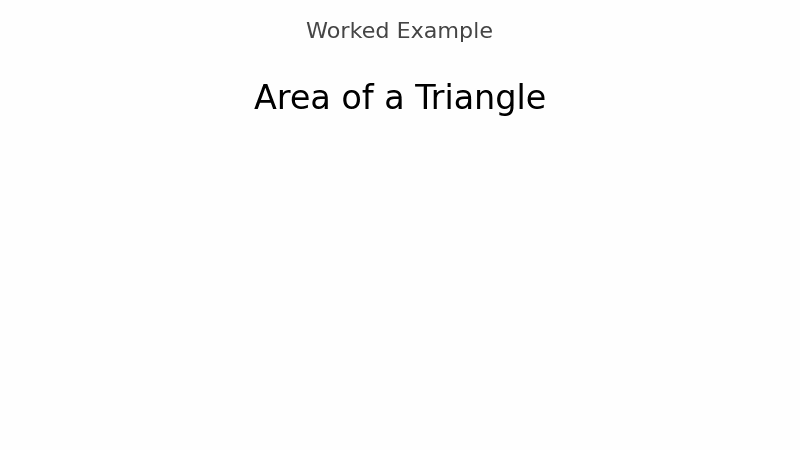

Final render: 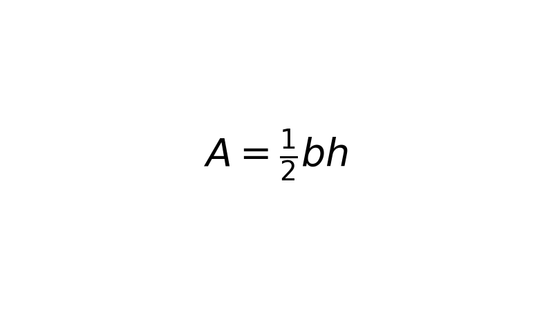

---

## Feature highlights

- **Cosine noise schedule** (Nichol & Dhariwal, 2021) — replaces linear β.
- **EMA shadow weights** — used at inference, standard in production diffusion.
- **FID evaluation** + sample-grid export (`evaluate.py`).
- **Spatiotemporal DiT** for video — 3-D patchify, AdaLN timestep/label conditioning, full space-time attention.
- **x̂₀-clamping reverse sampler** (static thresholding) — fixes from-pure-noise collapse; toggle via `clip_x0`.
- **Conditional *and* unconditional** video generation — AdaLN trajectory conditioning, or pure unconditional from-noise.
- **`--resume` for video training** — restores model + EMA + optimizer + epoch + loss history, so a GPU-host timeout is a non-event.
- **Optional loss reweighting** — low-t weighting and min-SNR-γ (Hang et al., 2023).
- **In-memory MovingMNIST cache** + cappable subset for bounded-cost runs.
- **Modal GPU training harness** (`scripts/`) for the video model.
- **Deterministic formula validator** (10 rules) with a JSON + SHA-256 **manifest audit trail**.

---

## Subsystem 1 — Image DDPM (mature)

Pixel-space DDPM (Ho et al., 2020), the foundation everything else builds on.

**Forward process** gradually destroys an image with Gaussian noise over `T=1000` steps. **Reverse process** trains a UNet to predict and remove that noise step by step. We predict the noise ε (not the image) because the exact noise added at each step is known — which yields a stable objective from the ELBO:

```
# Full ELBO:  L = L_T + Σ L_{t-1} + L_0
# L_{t-1}   = KL( q(x_{t-1}|x_t,x0) || p_θ(x_{t-1}|x_t) )
# Simplified (Ho et al., Eq.14):  L_simple = E || ε - ε_θ(x_t, t) ||²
Loss = MSE(predicted_noise, actual_noise)
```

### Noise schedule: linear → cosine

```
ā_t = cos²( (t/T + s) / (1+s) · π/2 )     s = 0.008
```

| | Linear β | Cosine ā_t |
|---|---|---|
| Signal at low t | destroyed too fast | preserved longer |
| Noise at high t | sometimes too noisy | smooth decay to ~0 |
| Sample quality | baseline | better FID |

The `s = 0.008` offset stops ā_T from reaching exactly 0. See [`scheduler/noise_scheduler.py`](scheduler/noise_scheduler.py).

### EMA

```
θ_ema ← 0.9999 · θ_ema + 0.0001 · θ_train     (every step)
```

Inference always uses the EMA weights — smoother, more stable samples (standard in DDPM, DALL·E 2, Stable Diffusion, DiT).

### UNet architecture (~3.6M params)

```
Input (xₜ, t)
│
├── SinusoidalTimeEmbedding(t) → injected at every ResBlock
│
[Encoder]   ResBlock(1→64) ─ skip₁ ;  ResBlock(64→128) ─ skip₂
[Bottleneck] ResBlock(128→256) → SelfAttention(256) → ResBlock(256→128)
[Decoder]   ⊕skip₂ → ResBlock(256→64) ;  ⊕skip₁ → ResBlock(128→64)
│
Conv1×1 → ε_pred
```

---

## Subsystem 2 — VideoDiT (prototype)

A minimal spatiotemporal Diffusion Transformer ε_θ(x_t, t) that extends the image DDPM to **video** (`model/video_dit.py`, ~7M params). It deliberately reuses the existing pieces unchanged — the EMA, the `CosineNoiseScheduler`, the sinusoidal time embedding and the DiT block — so the video path is the same math, extended to time.

```
video (B, C, T, H, W)
  → 3-D patchify (temporal tubes × spatial patches)
  → linear patch-embed + learnable positional embedding
  → N DiT blocks, AdaLN-conditioned on timestep t  (+ optional label)
  → linear head → 3-D unpatchify
  → predicted noise ε_θ (B, C, T, H, W)
```

The same timestep `t` applies to every frame of a clip; forward diffusion folds `(B,C,T,H,W)→(B,C·T,H,W)` to reuse the 4-D `add_noise`. Conditioning is DiT-style: a continuous attribute vector (the square's start position / velocity / size / brightness) is embedded and **added** to the timestep embedding, with a zero-initialised second layer so training starts identical to the unconditional baseline.

### Debugging the nucleation collapse

The honest centerpiece of this subsystem. Early on, VideoDiT refused to generate anything from **pure** noise — it collapsed to a constant all-black or all-white field. Three training-side fixes were tried and all failed identically:

- loss reweighting (low-t, uniform, min-SNR-γ) — collapsed,
- enlarging the square to 40–50% of the frame — collapsed,
- DiT AdaLN trajectory conditioning — collapsed.

The decisive probe was **partial reverse from start-t**: sampling recovered a clean square from *any* `t ≤ 950`, but collapsed only from `t = 999` (pure noise). That isolated the bug to the top ~5% of the chain — **the sampler, not the network**.

Root cause: at the top of the cosine chain `β_t` is clamped to `0.999`, so `α_t ≈ 1e-3` and the ε-form reverse mean carries a `1/√α_t ≈ 31×` factor. Any small DC bias in the ε prediction is amplified ~31× per step and, over the highest-t steps, drives the whole field to a saturated constant.

**The fix** (`scheduler/noise_scheduler.py`, `clip_x0=True`): reconstruct x̂₀ from ε, **clamp it to [-1, 1]** (static thresholding), and step with the *true* forward posterior `q(x_{t-1}|x_t, x̂₀)` instead of the unstable ε-form mean.

```
x̂₀ = (x_t − √(1−ā_t)·ε_θ) / √ā_t,   clamped to [−1, 1]
mean = (√ā_{t-1}·β_t)/(1−ā_t) · x̂₀  +  (√α_t·(1−ā_{t-1}))/(1−ā_t) · x_t
```

This removed the collapse with no retraining, and — as the MovingMNIST result shows — generalizes from the toy square to real video. The original ε-form mean is retained behind `clip_x0=False` for ablation.

> **Lesson, recorded for next time:** when DDPM samples collapse to saturated constants but partial-reverse from mid-t works, suspect top-of-chain mean amplification in the sampler, not the network.

### Known limitations (stated plainly)

- **Full O(N²) spatiotemporal attention** — all space-time tokens attend to all. Correct but doesn't scale; the next architectural step is **factorized** spatial + temporal attention (SVD / Sora style).
- **Blobby, not crisp** on MovingMNIST — a capacity/resolution ceiling at 32×32 and ~7M params, not a sampler bug.
- **MovingMNIST is unconditional** — the canonical dataset exposes no digit labels (and has two digits per clip), so class-conditioning would require rebuilding the dataset.

---

## Subsystem 3 — Pedagogy correctness engine (the moat)

Generative models hallucinate. For *education* — where a single wrong exponent or a drifted subscript teaches a falsehood — that is unacceptable. This subsystem's bet: **don't generate the facts, generate around them.** Keep every formula in a reviewed, immutable **ledger**; let generation handle only the visuals/motion.

**Three small, pure-Python, deterministic modules:**

- **`pedagogy/formula_ledger.py`** — the single source of truth. A `Formula` is a *canonical text object*: its LaTeX, label, symbols, subscripts, Greek letters and units are immutable. Downstream code may only *reference* a formula by `id` — never paraphrase or re-typeset it.
- **`pedagogy/scene_schema.py`** — a `Scene` is an ordered storyboard whose steps reference formulas **by id only** and carry no raw LaTeX, so a scene can never drift from the reviewed formula. The only free text is the scene title (checked to contain no LaTeX).
- **`pedagogy/formula_validator.py`** — the correctness gate. It refuses to let anything through unless it passes **10 deterministic rules**:

| Code | Catches |
|------|---------|
| L1 | LaTeX that won't typeset (mathtext subset) |
| S1 / S2 | symbols in the LaTeX but undeclared / declared but missing |
| S3 | casing drift (`b` vs `B`) |
| G1 | a concept id mapping to >1 token across the ledger |
| D1 | a duplicate symbol id within a formula |
| SC1–SC4 | scene referencing an unknown formula, smuggling raw LaTeX in a title, using an unknown step kind, or highlighting a symbol not in the formula |

The render pipeline (`pipelines/render_then_animate.py`) runs **VALIDATE → RENDER → ANIMATE → MANIFEST**: it aborts on any issue, typesets each formula's canonical LaTeX *verbatim*, animates the scene as a cumulative reveal, and writes a `manifest.json` recording the exact LaTeX and its **SHA-256** for every render — an audit trail proving what was shown.

```bash
python -m pedagogy.formula_validator     # → PASSED — all formulas and scenes are exactly correct.
python -m pipelines.render_then_animate   # → assets/pedagogy/<scene_id>/ (renders, frames, gif, manifest)
```

**Where this is heading (roadmap, not yet built):** condition the VideoDiT generation *on* a ledger-validated formula/scene, so the content stays exact (ledger) while the visuals and motion are generated (diffusion). That fusion — exact facts, generated presentation — is the actual long-term goal. Today the two subsystems are solid *separately*; wiring them together is the open work.

---

## DDPM → LDM → DiT: the full progression

This repo implements **pixel-space DDPM** as the foundation; the modern pipeline extends it:

```
DDPM (this repo)
  └── UNet noise predictor on raw pixels; forward/reverse diffusion in pixel space

LDM — Latent Diffusion (Rombach et al., 2022 — Stable Diffusion)
  └── VAE compresses image → latent z (8–16× smaller); diffusion runs in latent space

DiT — Diffusion Transformer (Peebles & Xie, 2023)
  └── replaces the UNet with a ViT; patchify → DiT blocks (AdaLN cond) → unpatchify
  └── scales better than UNet (DiT-XL: FID 2.27 on ImageNet 256²)
```

This repo's **VideoDiT is a DiT applied to space-time** — the same patchify/AdaLN idea, extended to video. See [`model/dit_block.py`](model/dit_block.py) for an annotated DiT block.

---

## Project structure

```
rahulk-ddpm/
├── model/
│   ├── time_embedding.py     # sinusoidal time embeddings
│   ├── resblock.py           # ResNet blocks + time conditioning
│   ├── attention.py          # self-attention at the UNet bottleneck
│   ├── unet.py               # image UNet noise predictor
│   ├── dit_block.py          # annotated DiT block (AdaLN + attention + MLP)
│   └── video_dit.py          # spatiotemporal Diffusion Transformer (video)
├── scheduler/
│   └── noise_scheduler.py    # cosine schedule; forward + reverse (x̂₀-clamp)
├── datasets/
│   └── video_dataset.py      # synthetic moving-shapes + MovingMNIST wrapper
├── pedagogy/
│   ├── formula_ledger.py     # canonical immutable formulas (source of truth)
│   ├── scene_schema.py       # scenes reference formulas by id only
│   └── formula_validator.py  # 10-rule exact-correctness gate
├── pipelines/
│   └── render_then_animate.py# validate → render → animate → manifest
├── scripts/                  # Modal GPU training harness (video)
├── train.py        sample.py        evaluate.py         # image DDPM
├── train_video.py  sample_video.py                      # video DiT (--resume)
└── config.yaml
```

---

## Quickstart

```bash
git clone https://github.com/rahulkhunte/rahulk-ddpm.git
cd rahulk-ddpm
pip install torch torchvision pyyaml pillow matplotlib scipy numpy
```

**Image DDPM**
```bash
python train.py                                              # train from scratch
python sample.py   --ckpt checkpoints/final_ema_model.pth    # samples + GIF
python evaluate.py --ckpt checkpoints/final_ema_model.pth --fid --n_samples 1000
```

**VideoDiT**
```bash
# tiny CPU smoke test
python train_video.py --epochs 1 --num_samples 16 --batch_size 4 --num_frames 8 --frame_size 16
# sample an unconditional checkpoint (e.g. the MovingMNIST run) → grid + gif
python sample_video.py --ckpt <ema.pth> --cond_features 0 --n 4 --tag movingmnist_
# resume a run after a timeout
python train_video.py --dataset movingmnist --resume checkpoints/video/resume_epoch_300.pth
```

**Pedagogy engine**
```bash
python -m pedagogy.formula_validator      # correctness gate
python -m pipelines.render_then_animate   # render + animate the worked example
```

---

## Training details

| Config | Image DDPM | VideoDiT |
|--------|-----------|----------|
| Data | MNIST / CIFAR-10 32×32 | synthetic square · MovingMNIST 32×32 |
| Diffusion steps T | 1,000 | 1,000 |
| β schedule | cosine | cosine |
| Predictor | UNet (~3.6M) | spatiotemporal DiT (~7M) |
| EMA decay | 0.9999 | 0.999 (short runs) |
| Optimizer | Adam + grad-clip 1.0 | Adam + grad-clip 1.0 |
| Hardware | Kaggle 2×T4 | Modal A10G |
| Sampler | ε-form | x̂₀-clamp (static thresholding) |

---

## References

- Ho, Jain & Abbeel (2020). **Denoising Diffusion Probabilistic Models.** NeurIPS. https://arxiv.org/abs/2006.11239
- Nichol & Dhariwal (2021). **Improved DDPM** (cosine schedule). ICML. https://arxiv.org/abs/2102.09672
- Peebles & Xie (2023). **Scalable Diffusion Models with Transformers (DiT).** ICCV. https://arxiv.org/abs/2212.09748
- Rombach et al. (2022). **High-Resolution Image Synthesis with Latent Diffusion Models.** CVPR. https://arxiv.org/abs/2112.10752
- Hang et al. (2023). **Efficient Diffusion Training via Min-SNR Weighting.** ICCV. https://arxiv.org/abs/2303.09556

---

**Rahul Khunte** — [github.com/rahulkhunte](https://github.com/rahulkhunte) · MIT License
